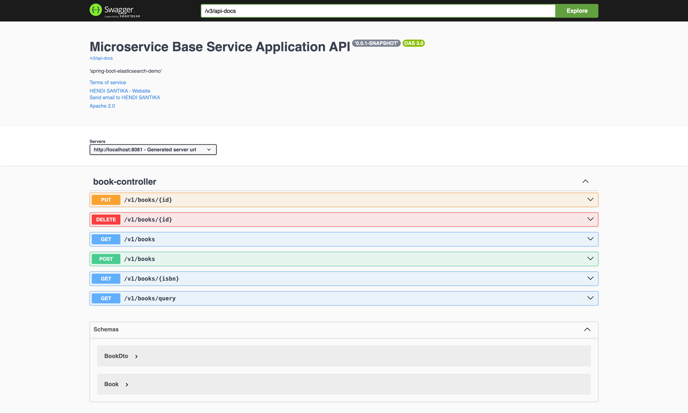

# spring-boot-elasticsearch-demo

### Things todo list

1. Clone this repository: `git clone https://github.com/hendisantika/spring-boot-elasticsearch-demo.git`
2. Navigate to the folder: `cd spring-boot-elasticsearch-demo`
3. Run the application: `mvn clean spring-boot:run`
4. Open your favorite browser: http://localhost:8081/swagger-ui

### Swagger UI

Swagger UI

